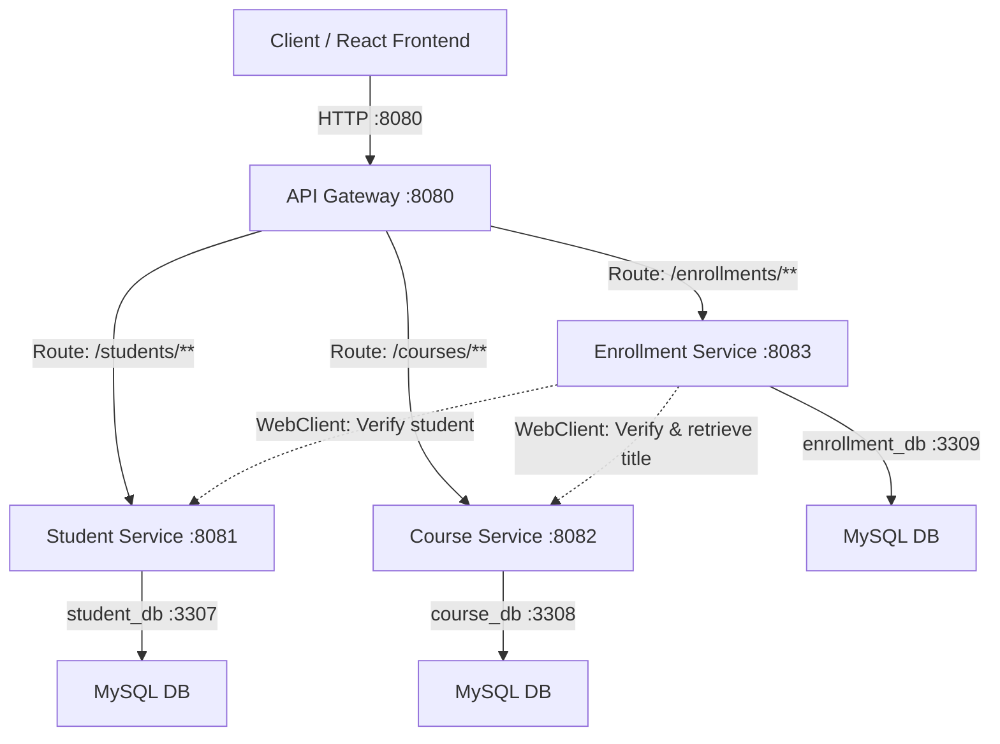

# Project Summary & Defense Q&A

This document provides a concise overview of the Student Enrollment Microservices architecture, business rules, technical stack, and targeted Q&As for a academic project defense.

---

## 1. Project Architecture & Setup

### Key Technical Stack
* **Java 21 & Spring Boot 3.3.6**
* **Spring Cloud Gateway**: Acts as the reverse proxy (single entry point).
* **Spring WebFlux WebClient**: Used for synchronous inter-service communication.
* **Databases**: Separated MySQL databases (`student_db` on `3307`, `course_db` on `3308`, `enrollment_db` on `3309`).
* **Frontend**: React, Vite, CSS, and Tailwind.

---

## 2. Core Business Rules

1. **Information Separation**: `enrollment_db` only stores reference IDs (`studentId`, `courseId`) and `enrolledAt`. Detailed student name, email, CNIE, and course title are fetched dynamically from their respective microservices.
2. **Limit of 3 Students**: A maximum of 3 students can be enrolled in any single course.
3. **24-Hour Cancellation**: Students can only cancel an enrollment within 24 hours of registering. The dashboard evaluates this dynamically and returns `canCancel`.

---

## 3. High-Probability Defense Q&As

### Q1. Why separate databases instead of a shared database?
* **Answer**: Direct database access across microservices breaks encapsulation and couples services tightly together. Using one database per service enforces **loose coupling** and **data sovereignty**—meaning only the owning service can change or query its schema.

### Q2. How does the Enrollment Service resolve student details (names, CNIEs) and course titles?
* **Answer**: By using **Spring WebFlux WebClient** to execute HTTP calls to the Student and Course services. When building the student dashboard, it queries its own DB for enrollment IDs, requests the student profile by CNIE, and queries the course titles using the referenced IDs.

### Q3. Why use an API Gateway?
* **Answer**: It serves as a **Reverse Proxy**. The client (frontend) only needs to communicate with the Gateway on port `8080`. The gateway translates public routes (`/students/**`, `/courses/**`, `/enrollments/**`) into local service requests, hiding ports `8081`, `8082`, and `8083` for security.

### Q4. How do you handle validation and exception errors?
* **Answer**: Input values are validated at the controller level using annotations (`@NotBlank`, `@NotNull`, `@Size`). Exceptions like `CourseFullException` or service-unreachable faults are mapped to clear HTTP status codes (`400 Bad Request`, `409 Conflict`, `404 Not Found`) via a global `@RestControllerAdvice` class.

### Q5. What happens if Student Service or Course Service is offline?
* **Answer**: Since the Enrollment Service uses synchronous HTTP requests via WebClient, it will receive an HTTP error. In our code, this throws a handled exception returning an appropriate error response back to the client instead of corrupting database state.

### Q6. How could you improve the reliability of inter-service calls?
* **Answer**: Implementing **Resilience4j** features like **Circuit Breakers** and **Retry Mechanisms** to gracefully handle temporary outages, along with utilizing asynchronous patterns using message queues (e.g. RabbitMQ, Kafka) if real-time synchronization is not required.

### Q7. What is Eureka, why didn't you implement it, and how does your routing/discovery work?
* **Answer**: **Netflix Eureka** is a service registry used for dynamic service discovery. In this project, I chose not to implement Eureka to keep the deployment overhead minimal. Instead, I used **static routing** via the API Gateway using environment-configured fixed URLs (e.g. `http://localhost:8081`). While Eureka is better for dynamic scaling in production, static routing is simpler and perfectly sufficient for this size of project.
